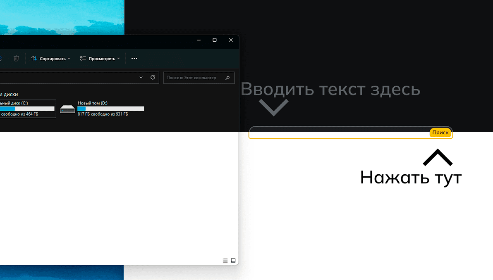
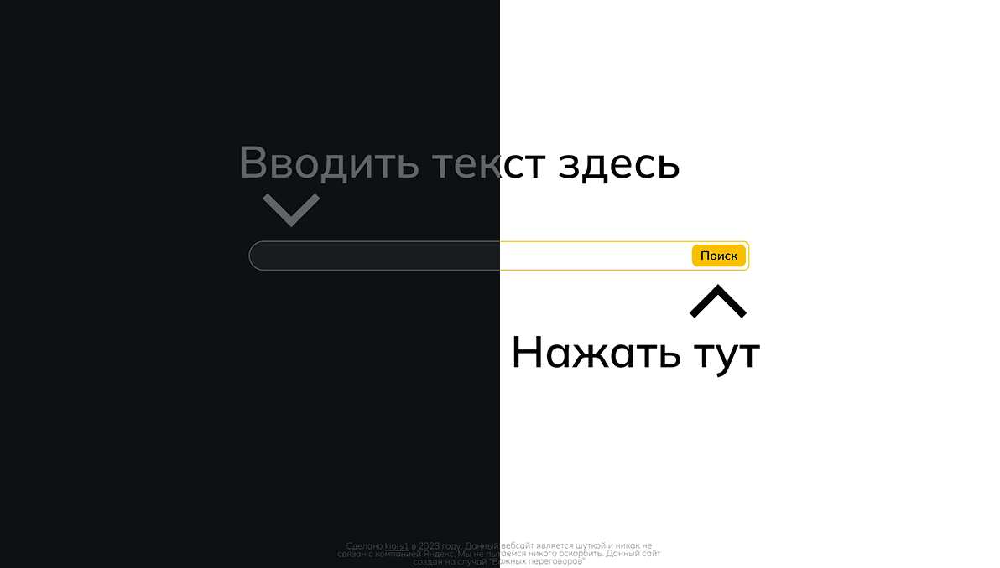

# Yandex-for-idiots

Это шуточная страница, которая должна решать проблемы с вопросами от некоторых пользователей.

За основу был взят сайт [Google-for-idipts](https://googleforidiots.com/). Раньше существовала и русская версия данного сайта.
Но поскольку аналогов на данный момент нет, был создан данный сайт.

Т.к. подобная страница изначально простовата, то была попытка немного поиграться с функциями браузера.

На странице релизованны:
1. Адаптивная верстка с попыткой сохранения % размеров во всех разрешениях.
2. Рабочий поиск.
3. rickroll eags
4. Смена темы сайта в зависимости от темы установленной пользователем на компьютере.

## Демонстрация

  В зависимости от темы ПК/Телефона выбранными пользователем, сайт меняет свое оформление.

  > 

## Ссылка на проект

   [Страница страницу YFI](https://kiars1.github.io/yandex-for-idiots/)
   
   

## Развитие проекта

❌ Переключение тем тумблером.